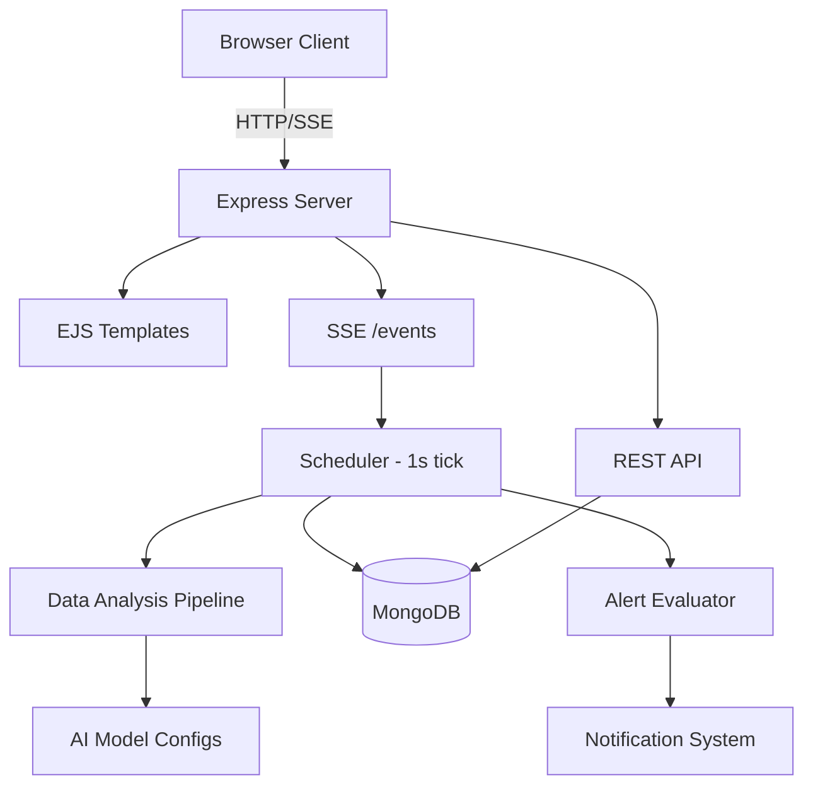

# Installation Guide

This guide explains how to set up the AI Safety Dashboard and provides an overview of its architecture and development environment.

---

## 1. Architecture Overview

The AI Safety Dashboard is a Node.js/Express application designed for high-fidelity monitoring and alerting.

- **Runtime**: Node.js 20
- **Framework**: Express 5
- **Database**: MongoDB 7
- **Templating**: EJS (Server-side rendering)
- **Real-time**: Server-Sent Events (SSE)
- **Architecture**: A modular system where a background scheduler generates simulated AI safety data, which is then evaluated against user-defined alert rules.



---

## 2. Prerequisites

Ensure you have the following installed on your system:

- **Node.js 20+**
- **MongoDB 7** (Community Edition)
- **Docker & Docker Compose** (Optional, for containerized setup)

---

## 3. Installation Steps

### Option A: Local Development

1. **Clone the repository**
2. **Install dependencies**:
   ```bash
   npm install
   ```
3. **Set up Environment Variables**:
   Create a `.env` file in the root directory. Use `.example.env` as a template:
   ```env
   DEFAULT_APP_USER=admin
   DEFAULT_ADD_EMAIL=admin@example.com
   DEFAULT_APP_PASSWORD=yourpassword
   SESSION_SECRET=your-session-secret
   MONGO_URL=mongodb://127.0.0.1:27017/dashboardDB
   ```
4. **Start MongoDB**: Ensure your local MongoDB service is running.
5. **Run the application**:
   ```bash
   npm start
   ```
6. **Access the Dashboard**: Visit `http://localhost:2121`.

### Option B: Docker Setup

The project includes a `docker-compose.yaml` that orchestrates the Node.js app and a MongoDB instance.

1. **Create the `.env` file** (as described in the local setup).
2. **Build and start the containers**:
   ```bash
   docker compose up --build
   ```
3. **Access the Dashboard**: Visit `http://localhost:2121`.

---

## 4. Environment Variables

| Variable               | Description                                      | Required |
| ---------------------- | ------------------------------------------------ | -------- |
| `DEFAULT_APP_USER`     | Username for the seeded admin account            | Yes      |
| `DEFAULT_ADD_EMAIL`    | Email for the seeded admin account               | Yes      |
| `DEFAULT_APP_PASSWORD` | Password for the seeded admin account            | Yes      |
| `SESSION_SECRET`       | Secret key for Express session encryption        | Yes      |
| `MONGO_URL`            | MongoDB connection string                        | Yes      |
| `PORT`                 | Server port (default: `2121`)                    | No       |
| `NODE_ENV`             | Environment mode (`development` or `production`) | No       |

---

## 5. Project Structure

```
├── ai_models/              # AI model definitions
├── config/                 # Database connection and seed data
├── constants/              # Shared constants (charts, roles, etc.)
├── controllers/            # Route handlers
├── data_analysis_pipeline/ # Simulated AI data generation engine
├── middleware/             # Auth and validation middleware
├── models/                 # Mongoose schemas
├── public/                 # Static assets (CSS, JS)
├── server_side_events/     # SSE scheduler and alert evaluator
└── views/                  # EJS templates
```

---

## 6. How it Works

### Real-Time Data Flow

The Heart of the system is the scheduler (`server_side_events/scheduler.js`):

1. **Every 1 second**: Generates simulated metric data for active AI models.
2. **Alert Evaluation**: Checks if the new data triggers any active alert rules.
3. **Broadcast**: Sends the data and any new notifications to the browser via **Server-Sent Events (SSE)**.

### Demo Scenarios

You can modify AI behavior via JSON configs in `data_analysis_pipeline/model_configs/`. This allows you to simulate different safety scenarios (e.g., high toxicity, PII leaks) without changing code.

---

## 7. First Startup

On the first run, the system will automatically:

1. Connect to MongoDB and create the database.
2. Seed the default admin user using your `.env` credentials.
3. Seed default roles, permissions, and dashboard chart configurations.
4. Initialize the real-time data scheduler.

## Read Next

- [Authentication](authentication.md)
- [AI Integration Guide](ai-integration.md)
- [Constants Reference](constants.md)
