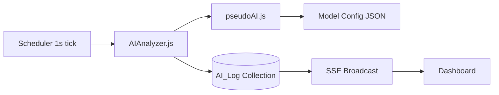
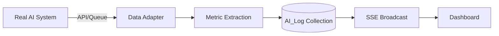

# AI Integration Guide: Dev to Production

This guide explains how to replace the fake data generator with a real AI model and what data the AI needs to pass to the dashboard.

## Current Architecture (Development)

In development, the data pipeline generates synthetic AI metrics:



The key files involved:
- `data_analysis_pipeline/pseudoAI.js` — generates fake call data using random distributions
- `data_analysis_pipeline/AIAnalyzer.js` — aggregates fake calls into summary statistics
- `data_analysis_pipeline/model_configs/*.json` — configuration files that control fake data behavior
- `data_analysis_pipeline/utilities/modelRegistry.js` — loads and manages model configs/scenarios
- `server_side_events/scheduler.js` — orchestrates the data generation loop

## Target Architecture (Production)

In production, the pipeline should receive real data from your AI system:



## What the Dashboard Expects

The dashboard consumes `AI_Log` documents. Each log entry must contain the following fields, as defined in the `DATA_DICTIONARY` (`constants/charts.js`):

### Required Fields

```js
{
    modelName: String,          // Must be one of KNOWN_MODELS (e.g., "GoodModel")
    policyCompliance: Number,   // 0-100 (percentage)
    responseHelpfulness: Number,// 1-5 (rating scale)
    responseTime: Number,       // milliseconds
    energyConsumption: Number,  // joules
    tokensUsed: Number,         // token count
    gigaFlopsUsed: Number,      // compute operations
    webLookups: Number,         // count of external lookups
    toxicityScore: Number,      // 0-1 (0 = safe, 1 = toxic)
    piiDetected: Number,        // 0-100 (percentage)
    queryCount: Number,         // number of queries in this interval
    responseTimestamp: Number,  // Unix timestamp in milliseconds (Date.now())
    flaggedCount: Number,       // number of flagged calls
    breakdown: Object,          // topic/subtopic breakdown (see below)
    flaggedOutputs: Object      // flagged output details (see below)
}
```

### The `breakdown` Object

The `breakdown` field provides per-topic and per-subtopic metric breakdowns. This enables the dashboard to split charts by topic or sub-topic. The structure follows the `TOPIC_HIERARCHY` from `constants/charts.js`:

```js
breakdown: {
    "Customer Support": {
        queryCount: 15,
        policyCompliance: 0.95,
        responseHelpfulness: 0.82,
        responseTime: 230,
        energyConsumption: 0.012,
        tokensUsed: 180,
        gigaFlopsUsed: 2.1,
        webLookups: 1,
        toxicityScore: 0.02,
        piiDetected: 0.03,
        flaggedCount: 0,
        subtopics: {
            "Troubleshooting": {
                queryCount: 8,
                policyCompliance: 0.96,
                // ... same fields as above
            },
            "Returns & Refunds": {
                queryCount: 7,
                // ...
            }
        }
    },
    "Sales & Inquiry": { /* ... */ },
    "General Use": { /* ... */ }
}
```

> **Note:** The `breakdown` object is stripped from `AI_Summary` records to save storage. Charts with timeframes longer than 15 minutes cannot be split by topic/sub-topic.

### The `flaggedOutputs` Object

Contains details about any AI outputs that were flagged during the interval. This is stored as a flexible object on the `AI_Log`.

## Step-by-Step Integration

### Step 1: Register Your AI Model

Add your model name to `constants/charts.js`:

```js
export const KNOWN_MODELS = [
    "YourModelName",
    // ... other models
];
```

Add it to `constants/sse.js` so the scheduler generates/expects data for it:

```js
export const AI_MODELS = ["YourModelName"];
```

Create a model definition file in `ai_models/`:

```js
// ai_models/YourModelName.js
const modelParams = {
    name: "YourModelName",
    label: "Your Model Display Name"
};
export default modelParams;
```

### Step 2: Replace the Data Generator

The scheduler calls `AIAnalyzer()` in `generateModelData()` inside `server_side_events/scheduler.js`. This is the function you need to modify.

**Option A: Replace `AIAnalyzer` with a real data source**

Modify `generateModelData()` in `scheduler.js` to fetch real metrics instead of calling `AIAnalyzer`:

```js
async function generateModelData(modelName) {
    // Replace this:
    // const summary = AIAnalyzer(modelName, SCHEDULER_INTERVAL / 1000, previousGeneralizations);

    // With your real data source:
    const summary = await fetchRealMetrics(modelName);

    return {
        modelName: modelName,
        policyCompliance: summary.policyCompliance,
        responseHelpfulness: summary.responseHelpfulness,
        responseTime: summary.responseTime,
        energyConsumption: summary.energyConsumption,
        tokensUsed: summary.tokensUsed,
        gigaFlopsUsed: summary.gigaFlopsUsed,
        webLookups: summary.webLookups,
        toxicityScore: summary.toxicityScore,
        piiDetected: summary.piiDetected,
        queryCount: summary.queryCount,
        responseTimestamp: Date.now(),
        breakdown: summary.breakdown,
        flaggedCount: summary.flaggedCount,
        flaggedOutputs: summary.flaggedOutputs
    };
}
```

**Option B: Push data via an API endpoint**

Create a new API endpoint that accepts AI metrics and inserts them directly into the `AI_Log` collection, bypassing the scheduler entirely. You would then disable the scheduler's auto-generation for that model.

**Option C: Hybrid approach**

Keep the scheduler running but have it pull from a message queue or shared database where your real AI system writes its metrics.

### Step 3: Implement Metric Extraction

If your AI system doesn't natively produce these metrics, you'll need a data adapter layer. Here's what each metric means and how to derive it:

| Metric | How to Derive |
|---|---|
| `policyCompliance` | Run output through a policy classifier. Percentage of compliant responses. |
| `responseHelpfulness` | Use a helpfulness scoring model or user feedback ratings (1-5). |
| `responseTime` | Measure wall-clock time from request to response. |
| `energyConsumption` | Estimate from GPU utilization and inference time, or use provider metrics. |
| `tokensUsed` | Sum of input + output tokens (available from most LLM APIs). |
| `gigaFlopsUsed` | Estimate from model size and token count, or use provider metrics. |
| `webLookups` | Count of tool/function calls that access external URLs. |
| `toxicityScore` | Run output through a toxicity classifier (e.g., Perspective API). |
| `piiDetected` | Run output through a PII detection model (e.g., Presidio). |
| `queryCount` | Count of user queries processed in the interval. |
| `flaggedCount` | Count of outputs that triggered any safety flag. |

### Step 4: Handle Topic Classification

The dashboard expects each AI interaction to be classified into a topic and sub-topic from the `TOPIC_HIERARCHY`. In production, you can:

1. Use an LLM-based classifier to categorize each query
2. Use keyword matching or intent detection
3. Map from your existing categorization system to the hierarchy

If your topics differ, update `TOPIC_HIERARCHY` in `constants/charts.js` to match your domain.

### Step 5: Remove Demo Components (Optional)

For a production deployment, you may want to remove or restrict:

- The demo page and routes (`/demo`, `routers/demoRouter.js`, `controllers/demoController.js`)
- The `data_analysis_pipeline/` folder (no longer needed with real data)
- Demo scenarios from model configs
- The `view:demo` permission from roles

### Step 6: Adjust Timing

The default scheduler runs every 1 second. In production, adjust `SCHEDULER_INTERVAL` in `constants/sse.js` to match your AI system's throughput. If your AI processes queries in batches, you might increase this to 5 or 10 seconds.

Similarly, adjust `SUMMARY_INTERVAL` and `AI_LOG_CUTOFF` based on your data retention needs.

## Summary of Files to Modify

| File | Change |
|---|---|
| `constants/charts.js` | Update `KNOWN_MODELS` and optionally `TOPIC_HIERARCHY` |
| `constants/sse.js` | Update `AI_MODELS`, adjust intervals |
| `ai_models/YourModel.js` | Create model definition |
| `server_side_events/scheduler.js` | Replace `AIAnalyzer` call in `generateModelData()` |
| `data_analysis_pipeline/` | Can be removed entirely if not using fake data |

## Read Next
- [Installation](installation.md)
- [Constants Reference](constants.md)
- [Dashboard](dashboard.md)
