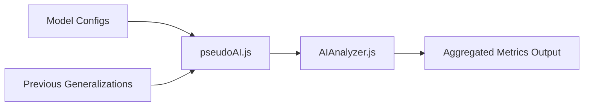
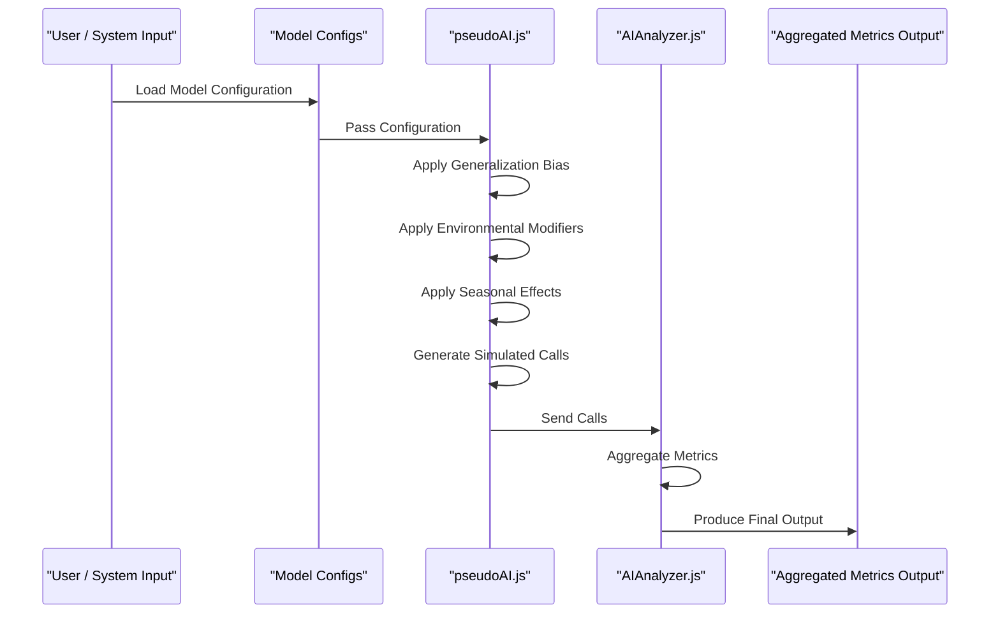
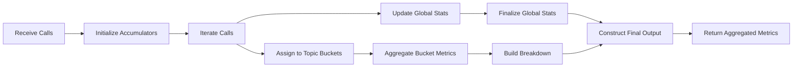
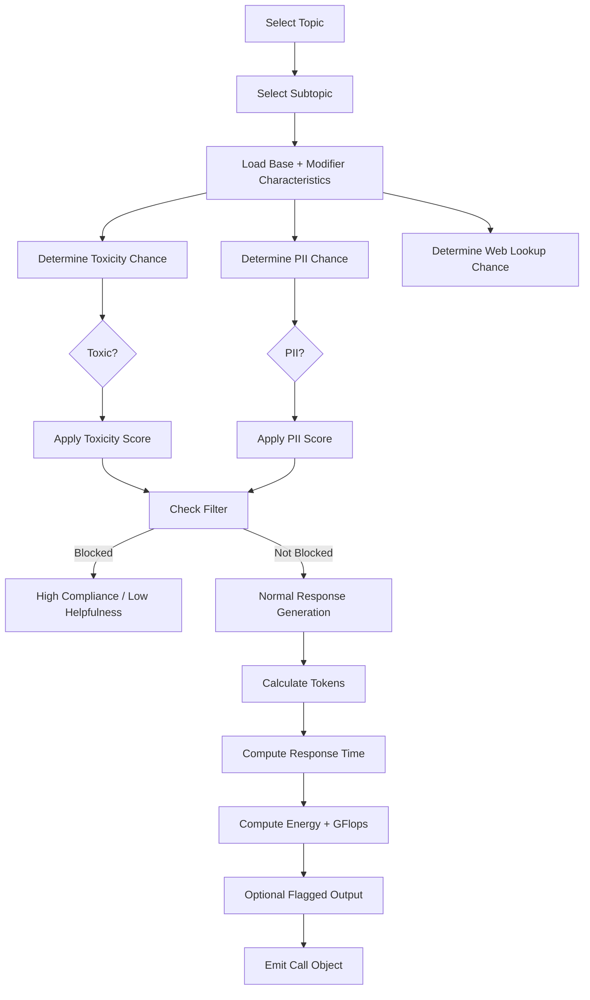
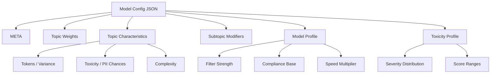
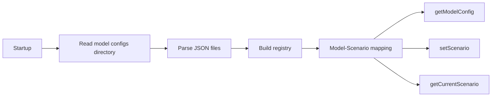
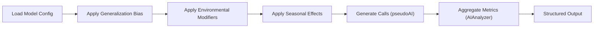

# Data Analysis Pipeline
This file contains information about the mocked data analysis pipeline and migrating to a real AI system.

## Overview
This module simulates an AI analytics pipeline that generates, processes, and aggregates model interaction data. It is designed as a **mock system** to emulate real AI telemetry, enabling development, testing, and visualization before integrating an actual AI backend.

The pipeline consists of:
- A **pseudo AI generator** that simulates model behavior
- A **config-driven model system** for different AI profiles
- An **analysis engine** that aggregates metrics
- Supporting utilities for randomness and configuration management

---

## Architecture


*Flow Diagram*

*Sequence Diagram*

---

## Core Components

### 1. AIAnalyzer.js

*Flow Diagram*

**Purpose:** Aggregates and summarizes AI call data into meaningful metrics.

#### Key Features:
- Streaming statistics accumulator:
  - min / max / mean / median
- Tracks:
  - Response time
  - Tokens used
  - Energy consumption
  - Toxicity
  - PII detection
  - Helpfulness
  - Policy compliance
- Produces:
  - Global metrics
  - Topic & subtopic breakdowns
  - Flagged outputs

#### Output Structure:
```json
{
  "model": "ModelName",
  "time": { "min": 0, "max": 0, "mean": 0, "median": 0 },
  "policyCompliance": {},
  "responseHelpfulness": {},
  "responseTime": {},
  "energyConsumption": {},
  "tokensUsed": {},
  "gigaFlopsUsed": {},
  "webLookups": {},
  "toxicityScore": {},
  "piiDetected": {},
  "flaggedOutputs": [],
  "flaggedCount": 0,
  "breakdown": {},
  "queryCount": 0,
  "responseTimestamp": 0
}
```

---

### 2. pseudoAI.js
**Purpose:** Simulates AI model behavior and generates synthetic interaction data.

#### Key Systems:
**a. Generalization Bias**
* Uses previous outputs to influence:
  * Toxicity
  * PII likelihood
  * Topic weighting
* Applies decay over time

**b. Long-Term Environment Effects**
* Time-based behavior:
  * Hour of day
  * Day of week
* Simulates:
  * Traffic variation
  * User behavior shifts
  * Topic fatigue

**c. Seasonal Modifiers**
* Yearly cyclical trends:
  * Productivity vs leisure
  * Technology interest
  * Traffic scaling

**d. Call Generation**

*Flow Diagram*

Each simulated call includes:
```json
{
  "model": "ModelName",
  "time": 123456789,
  "tokensUsed": 123,
  "gigaFlopsUsed": 1.23,
  "policyCompliance": 0.95,
  "responseHelpfulness": 0.9,
  "responseTime": 500,
  "energyConsumption": 0.6,
  "webLookups": 2,
  "topic": "Customer Support",
  "sub_topic": "Returns & Refunds",
  "toxicityScore": 0.1,
  "piiDetected": 0,
  "flagged": null
}
```

---

### 3. Model Configurations (model_configs/)

*Hierarchy Diagram*

**Purpose:** Defines behavior profiles for different simulated AI models.

**Included Models:**
* GoodModel
* BadModel

**Scenarios:**
* Normal
* Rogue

*Normal is required for modelRegistry.js*

**Config Sections**  
**META**
```json
{
  "ModelName": "GoodModel",
  "Scenario": "Normal"
}
```
**Topic Weights**
Controls distribution of query types.

**Topic Characteristics**  
Defines:
* Token usage
* Toxicity probability
* PII probability
* Complexity

**Subtopic Modifiers**
Overrides per subcategory (e.g., Programming, Conversation).

**Model Profile**  
Controls:
* Filtering strength
* Base compliance
* Helpfulness when blocked
* Speed multiplier

**Toxicity Profile**
Defines severity distribution and scoring ranges.

---

### 4. modelRegistry.js


**Purpose:** Loads and manages model configurations.

**Responsibilities:**
* Dynamically loads all JSON configs
* Supports multiple scenarios per model
* Provides:
  * `getModelConfig(name)`
  * `setScenario(model, scenario)`
  * `getCurrentScenario(model)`

---

### 5. random.js
Utility functions for stochastic simulation:
* Random floats and integers
* Weighted random selection
* Boolean probability checks

---

## Data Flow


### Step-by-Step:
1. Load model configuration
2. Apply:
  * Generalization bias
  * Environmental modifiers
  * Seasonal effects
3. Generate simulated calls
4. Aggregate metrics via `AIAnalyzer`
5. Output structured analytics

---

### Key Metrics Explained
| Metric               | Description                |
| -------------------- | -------------------------- |
| Response Time        | Latency per request        |
| Tokens Used          | Output size                |
| Energy Consumption   | Derived from compute usage |
| GigaFlops Used       | Estimated compute cost     |
| Policy Compliance    | Safety adherence           |
| Response Helpfulness | Quality score              |
| Toxicity Score       | Harmfulness level          |
| PII Detected         | Sensitive data presence    |
| Web Lookups          | External dependency usage  |

---

### Mock vs Real AI System
#### Current (Mocked)
* Fully synthetic data generation
* Deterministic + stochastic modeling
* Config-driven behavior

---

#### Transition to Real AI

**Replace:**
* generateCalls() → real API call logs
* Randomized metrics → actual telemetry

**Keep:**
* AIAnalyzer (aggregation logic)
* Breakdown structure
* Metric schema

**Add:**
* Real-time ingestion pipeline
* Persistent storage (DB / streaming)
* Observability hooks (logs, tracing)

---
## Capabilities

### Design Strengths
* **Decoupled architecture:**  
  Simulation and analysis are independent
* **Config-driven models:**  
  Easily extendable
* **Scalable aggregation:**  
  Single-pass computations
* **Realistic simulation:**  
  Time, seasonality, and feedback loops

---

### Limitations
* Synthetic randomness may not reflect real-world distributions
* No real user intent modeling
* Limited long-term memory fidelity
* No true semantic understanding

---

### Future Improvements
* Replace pseudoAI with real inference logs
* Add anomaly detection
* Introduce reinforcement learning feedback loops
* Improve topic hierarchy dynamics
* Stream processing (Kafka / full SSE integration)

---

## Summary
This pipeline provides a robust testbed for AI analytics, allowing development of dashboards, monitoring tools, and evaluation systems without requiring a live AI backend. It is designed for smooth migration to real-world AI systems with minimal structural changes.