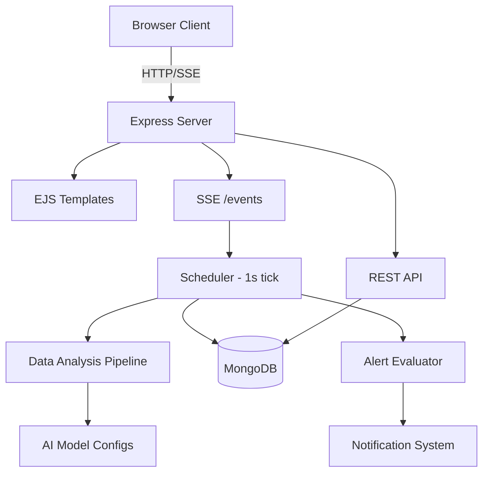

# Development Environment

This guide explains how the development environment works and how to get it running locally.

## Architecture Overview

The AI Safety Dashboard is a Node.js/Express application with the following stack:

- **Runtime**: Node.js 20
- **Framework**: Express 5
- **Database**: MongoDB 7
- **Templating**: EJS (server-side rendered views)
- **Charts**: Chart.js (client-side)
- **Real-time**: Server-Sent Events (SSE)
- **Authentication**: Passport.js with local strategy
- **PDF Generation**: Puppeteer + PDFKit
- **API Docs**: Swagger UI + OpenAPI 3.0



## Project Structure

```
├── ai_models/              # AI model definitions (name + label)
├── config/                 # Database connection, Passport config, seed data
├── constants/              # Shared constants (charts, roles, permissions, SSE, notifications)
├── controllers/            # Route handlers / business logic
├── data_analysis_pipeline/ # Fake AI data generation (replaced in production)
│   ├── model_configs/      # JSON configs per model per scenario
│   ├── utilities/          # Model registry, random helpers
│   └── flagged_output_pool/# Sample flagged outputs
├── documentation/          # Docsify documentation site
├── middleware/             # Auth and authorization middleware
├── models/                 # Mongoose schemas
├── public/                 # Static assets (CSS, JS, images)
├── routers/                # Express route definitions
├── server_side_events/     # SSE scheduler, alert evaluator, state
├── tests/                  # Test files
├── utils/                  # Utility functions
└── views/                  # EJS templates
```

## Running Locally (Without Docker)

### Prerequisites
- Node.js 20+
- MongoDB 7 (running locally or via MongoDB Atlas)

### Steps

1. Clone the repository
2. Install dependencies:
   ```bash
   npm install
   ```
3. Create a `.env` file in the project root (see `.example.env`):
   ```env
   DEFAULT_APP_USER=admin
   DEFAULT_ADD_EMAIL=admin@example.com
   DEFAULT_APP_PASSWORD=yourpassword
   SESSION_SECRET=your-session-secret
   MONGO_URL=mongodb://127.0.0.1:27017/dashboardDB
   ```
4. Start MongoDB (if running locally)
5. Start the server:
   ```bash
   npm start
   ```
6. Visit `http://localhost:2121`

On first startup, the server will:
- Connect to MongoDB
- Seed a default admin user from the `.env` values
- Seed default chart configurations
- Seed default roles into the database
- Start the SSE scheduler (generates data every second)

## Running with Docker

The project includes Docker support for containerized deployment.

### docker-compose.yaml
Defines two services:
- `dashboard` — the Node.js application (built from `Dockerfile`)
- `dashboard-mongo` — a MongoDB 7 instance with persistent volume

### docker-compose.override.yml
Maps port `2121` on the host to `2121` in the container. This file is automatically applied during development.

### Dockerfile
- Based on `node:20-alpine`
- Installs Chromium (for Puppeteer PDF generation)
- Copies source and installs npm dependencies
- Exposes port 3000 internally (mapped via compose)

### Running
```bash
docker compose up --build
```

The app will be available at `http://localhost:2121`.

## Environment Variables

| Variable | Description | Required |
|---|---|---|
| `DEFAULT_APP_USER` | Username for the seeded admin account | Yes |
| `DEFAULT_ADD_EMAIL` | Email for the seeded admin account | Yes |
| `DEFAULT_APP_PASSWORD` | Password for the seeded admin account | Yes |
| `SESSION_SECRET` | Secret key for Express session encryption | Yes |
| `MONGO_URL` | MongoDB connection string | Yes |
| `PORT` | Server port (default: `2121`) | No |
| `PUBLIC_URL` | Base URL path for reverse proxy setups | No |
| `NODE_ENV` | Environment mode (`development` or `production`) | No |
| `PUPPETEER_EXECUTABLE_PATH` | Path to Chromium binary (set automatically in Docker) | No |

## How Real-Time Data Works

The scheduler (`server_side_events/scheduler.js`) is the heart of the real-time system:

1. Every **1 second** (`SCHEDULER_INTERVAL`), the scheduler calls `AIAnalyzer()` for each model in `AI_MODELS`
2. `AIAnalyzer` uses `pseudoAI.js` to generate simulated call data based on model configs
3. The generated data is saved as `AI_Log` documents in MongoDB
4. The alert evaluator checks all active alerts against the new data
5. The data is broadcast to all connected SSE clients via the `update` event

Every **1 minute** (`SUMMARY_INTERVAL`):
1. The last 60 seconds of `AI_Log` entries are averaged into an `AI_Summary`
2. `AI_Log` entries older than `AI_LOG_CUTOFF` (1 day) are deleted

### SSE Events

| Event | Description |
|---|---|
| `update` | New AI log data (sent every second) |
| `summary` | New AI summary data (sent every minute) |
| `notification` | Real-time notification (alerts, demo changes, server events) |
| `alert` | Alert triggered event |

### Scheduler State

The scheduler can be paused/resumed via the control panel API (`/api/params`). State is stored in `schedulerState.js`:
- `isPaused` — whether data generation is paused
- `activeModel` — the currently selected model

## Demo Scenarios

The demo system allows switching AI model behavior without code changes. Each model can have multiple scenarios defined as JSON config files in `data_analysis_pipeline/model_configs/`.

Config files follow the naming pattern: `<model_name>_config.json` or `<scenario>_<model_name>_config.json`.

Each config contains:
- `META` — model name and scenario name
- `TOPIC_WEIGHTS` — probability distribution across topics
- `TOPIC_CHARACTERISTICS` — per-topic behavior (tokens, toxicity chance, PII chance, etc.)
- `SUBTOPIC_CHARACTERISTICS_MODIFIERS` — per-subtopic overrides
- `MODEL_PROFILE` — model-level behavior (filter strength, compliance, speed)
- `TOXICITY_PROFILE` — severity distribution and score ranges

Scenarios are managed via the Demo page (`/demo`) or the demo API.

## Database Models

| Model | Collection | Description |
|---|---|---|
| `User` | users | User accounts with roles and preferences |
| `AI_Log` | ai_logs | High-fidelity per-second AI metrics |
| `AI_Summary` | ai_summaries | Per-minute aggregated AI metrics |
| `Alert` | alerts | Alert rule definitions |
| `AlertLog` | alertlogs | Historical record of triggered alerts |
| `Tag` | tags | User-created tags for organizing alerts |
| `HistoricalTag` | historicaltags | Immutable snapshots of tags at time of use |
| `Notification` | notifications | System and alert notifications |
| `Role` | roles | Custom and system role definitions |
| `Chart_Config` | chart_configs | Dashboard chart configurations |
| `User_Log` | user_logs | Audit trail of user actions |

## Read Next
- [AI Integration Guide](ai-integration.md)
- [Constants Reference](constants.md)
- [Installation](installation.md)
