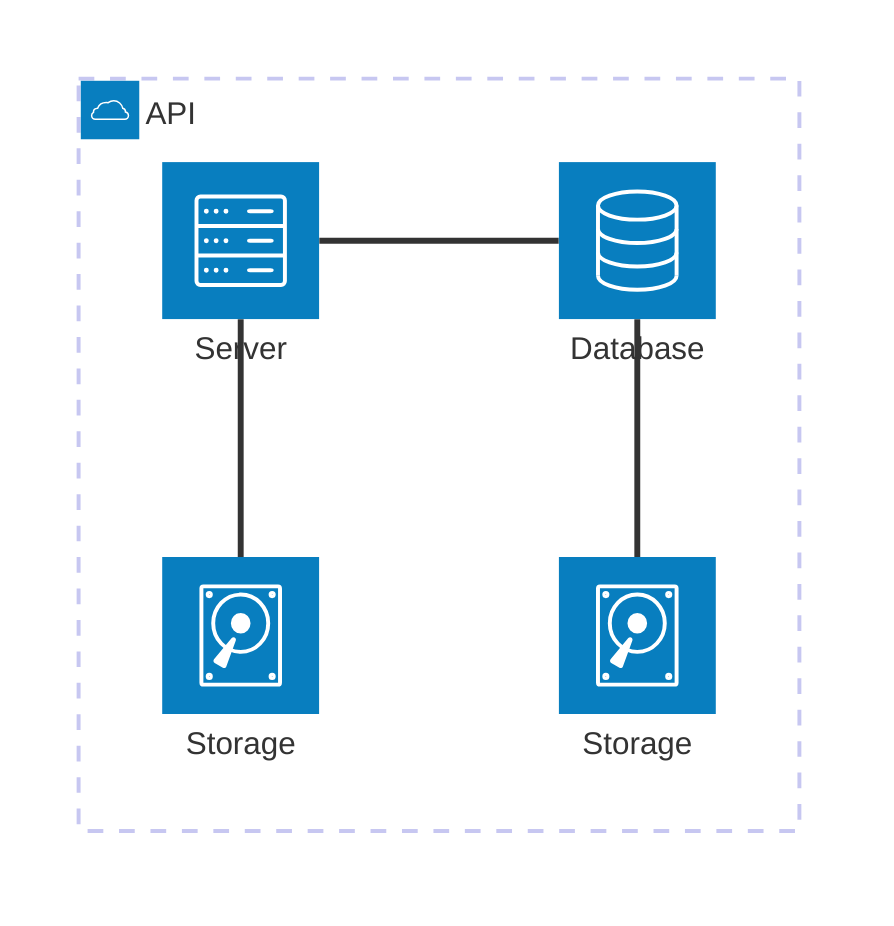

# Example Chart
- This shows that we can use Mermaid JS inside of these docs.
- This example chart was taken from Mermaid Js examples list [here](https://mermaid.live/edit#pako:eNqNkd9LwzAQx_-Vck8ddCPN-mt5U_ciKIj65LqHtDm7sDUpaSrq2P9u0m4ICuI95O7y_XyTcDlCrQUCA27qnbRY28HgvELLSxW4aIweuoB3MqwPehCzzdXD7bZUk9ijeZM1BqIKBbe84j3ONutztQ2k8sYfqOz3cejX2ebJasObP0D6H9BnNOGUHDvmb3SCRcXugvk8eGQTd971j2HPXrj-JdCLICqIoDFSALNmwAhaNC33LRw9XoLdYYslMFcKbvYllOrkPB1XL1q3F5ubZLMD9soPveuGzo0M15I3hn8jqASaGz0oC4xmyXgGsCO8A0vjYkFInhZFQZIkTuIIPhy0jBfFapnlaRLTnNJVdorgc7yVLIo8JS5oRvKc0NQ5UEg3y_vpy8efP30BhAyi-A).

