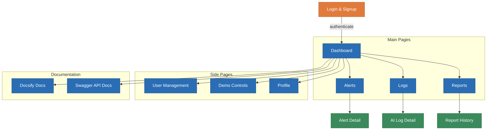
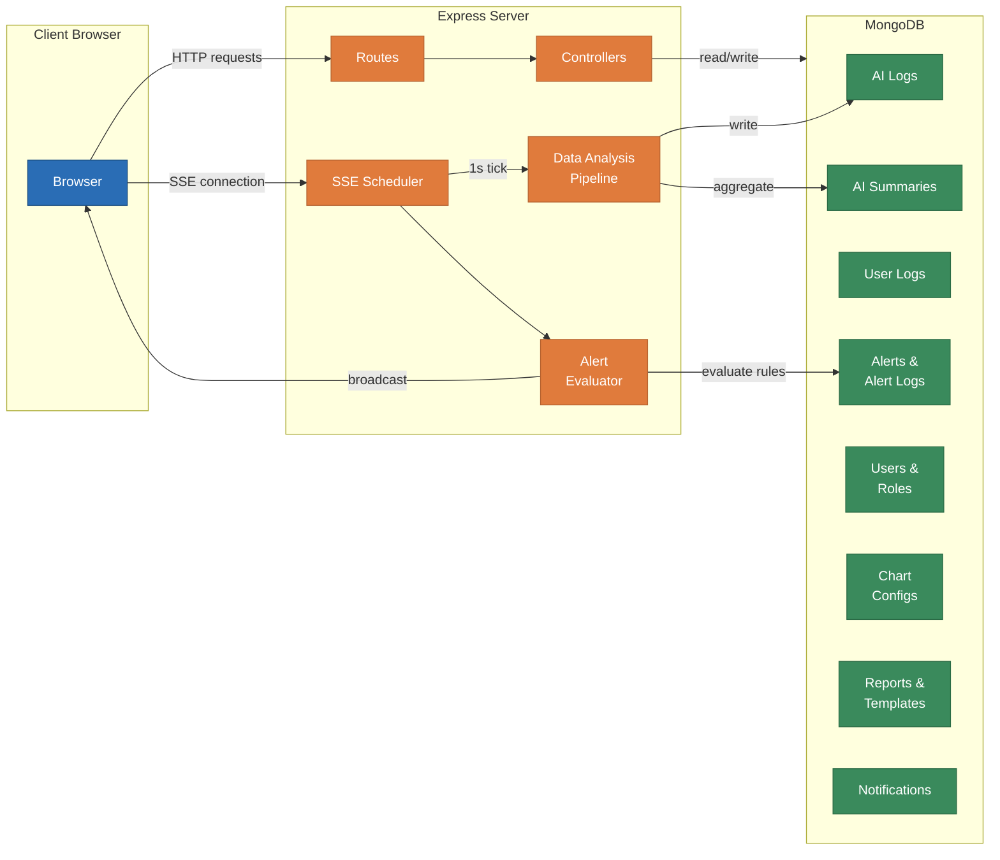

# Site Diagram

This diagram shows the pages and navigation structure of the AI Safety Dashboard.

## Application Sitemap

```mermaid
flowchart TD
    login["Login & Signup"]

    login -- "authenticate" --> dashboard

    subgraph main ["Main Pages"]
        dashboard["Dashboard"]
        alerts["Alerts"]
        logs["Logs"]
        reports["Reports"]
    end

    subgraph side ["Side Pages"]
        admin["User Management"]
        demo["Demo Controls"]
        profile["Profile"]
    end

    subgraph documentation ["Documentation"]
        docs["Docsify Docs"]
        apidocs["Swagger API Docs"]
    end

    dashboard --> alerts
    dashboard --> logs
    dashboard --> reports
    dashboard --> admin
    dashboard --> demo
    dashboard --> profile
    dashboard --> docs
    dashboard --> apidocs

    alerts --> alertdetail["Alert Detail"]
    logs --> logdetail["AI Log Detail"]
    reports --> reporthistory["Report History"]

    %% Styling
    classDef page fill:#2a6db5,stroke:#1a4d80,color:#fff
    classDef auth fill:#e07b3c,stroke:#b5622f,color:#fff
    classDef sub fill:#3a8a5c,stroke:#2a6a44,color:#fff

    class login auth
    class dashboard,alerts,logs,reports page
    class admin,demo,profile page
    class docs,apidocs page
    class alertdetail,logdetail,reporthistory sub
```

## Data Flow

```mermaid
flowchart LR
    subgraph client ["Client Browser"]
        browser["Browser"]
    end

    subgraph server ["Express Server"]
        routes["Routes"]
        controllers["Controllers"]
        sse["SSE Scheduler"]
        pipeline["Data Analysis\nPipeline"]
        alertEval["Alert\nEvaluator"]
    end

    subgraph db ["MongoDB"]
        aiLog["AI Logs"]
        aiSummary["AI Summaries"]
        userLog["User Logs"]
        alertData["Alerts &\nAlert Logs"]
        userData["Users &\nRoles"]
        chartConfig["Chart\nConfigs"]
        reportData["Reports &\nTemplates"]
        notifications["Notifications"]
    end

    browser -- "HTTP requests" --> routes
    routes --> controllers
    controllers -- "read/write" --> db
    browser -- "SSE connection" --> sse
    sse -- "1s tick" --> pipeline
    pipeline -- "write" --> aiLog
    pipeline -- "aggregate" --> aiSummary
    sse --> alertEval
    alertEval -- "evaluate rules" --> alertData
    alertEval -- "broadcast" --> browser

    classDef clientNode fill:#2a6db5,stroke:#1a4d80,color:#fff
    classDef serverNode fill:#e07b3c,stroke:#b5622f,color:#fff
    classDef dbNode fill:#3a8a5c,stroke:#2a6a44,color:#fff

    class browser clientNode
    class routes,controllers,sse,pipeline,alertEval serverNode
    class aiLog,aiSummary,userLog,alertData,userData,chartConfig,reportData,notifications dbNode
```
